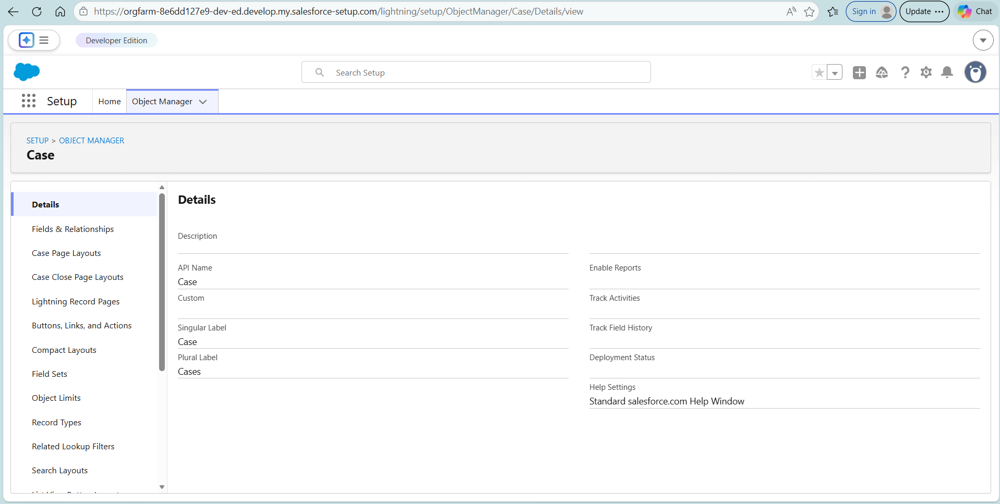
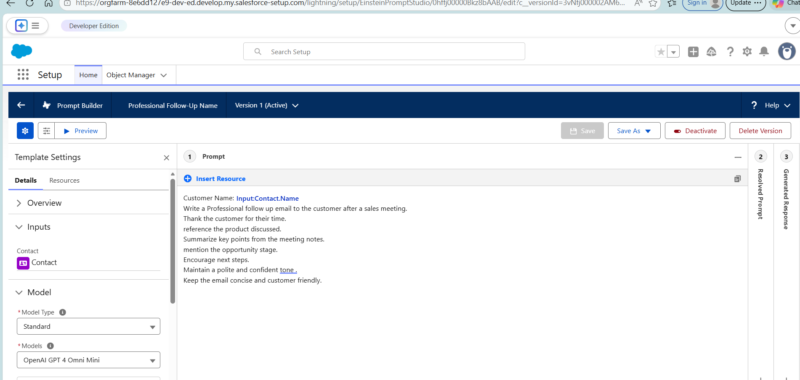
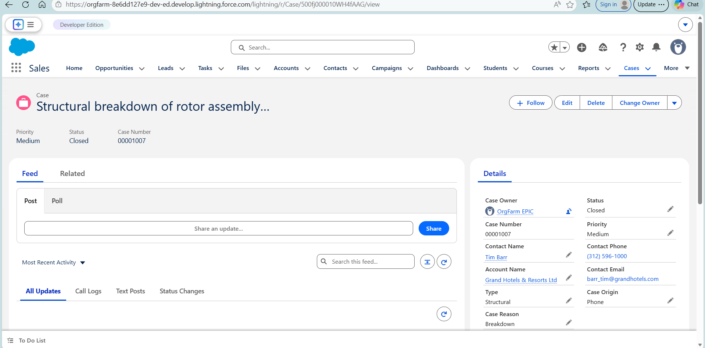
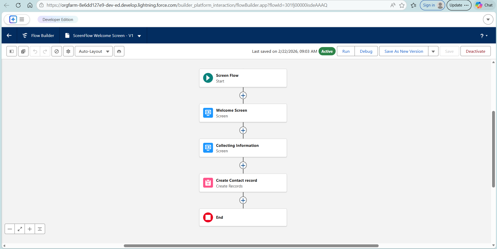
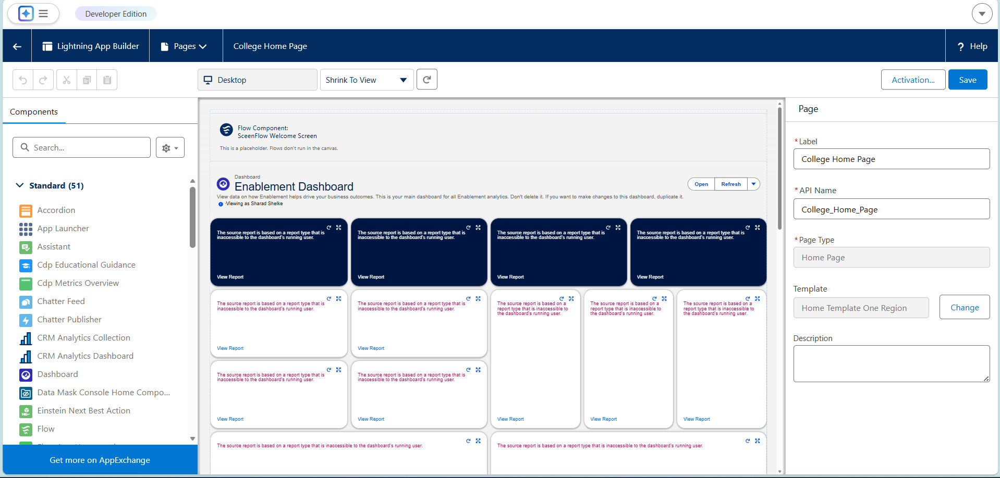
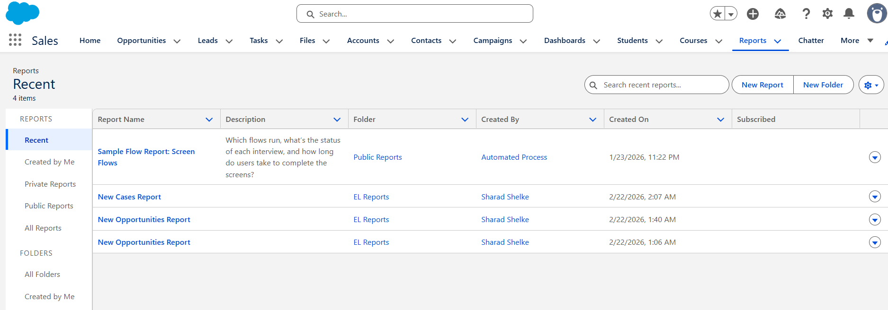
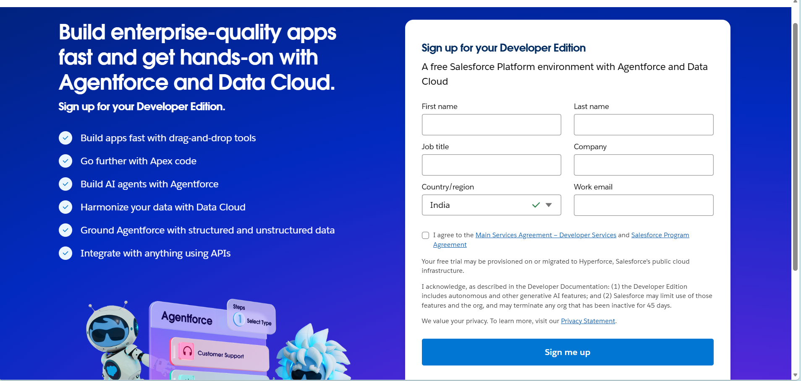
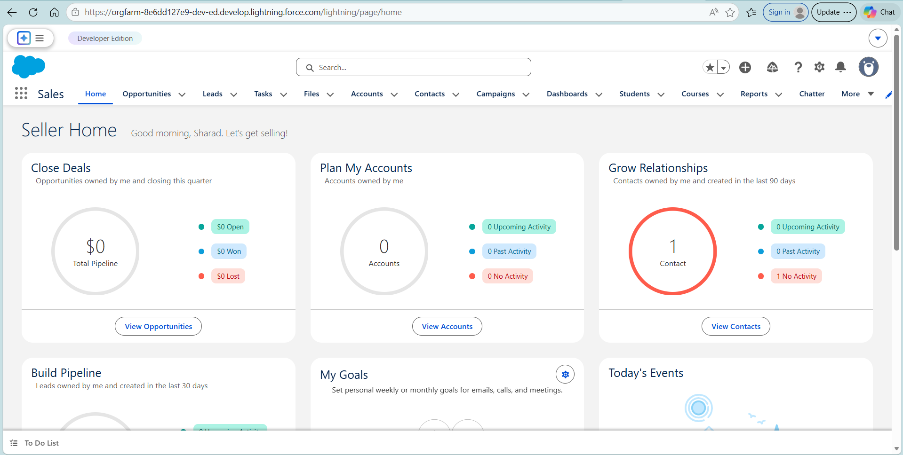

# AI-Powered Customer Support & Service Automation (Salesforce)

## 📌 Project Overview
This project demonstrates the implementation of an AI-enabled Customer Support and Service Automation system using Salesforce.

The system automates customer case handling by generating AI-powered responses and case summaries using Salesforce Prompt Builder. It enhances efficiency, reduces manual effort, and ensures consistent customer communication.

---

## 🎯 Objectives
- Automate customer case management
- Generate AI-based response suggestions
- Create automatic case summaries
- Implement role-based access control
- Provide reporting and dashboard analytics

---

## 🛠 Tools & Technologies Used
- Salesforce CRM
- Prompt Builder (Field Generation)
- Lightning App Builder
- Flow Builder (Record Triggered Flow)
- Reports & Dashboards

---

## 🏗 System Modules

### 1️⃣ Case Management
- Standard Case Object
- Custom fields (Issue Type, AI Response, AI Summary, etc.)
- Status tracking

### 2️⃣ AI Integration
- Field Generation Prompt Template
- AI-generated response stored in Case record
- AI-generated internal summary

### 3️⃣ Automation
- Record-triggered Flow
- Case assignment rules
- Validation rules

### 4️⃣ Security
- Role-based access
- Field-level security
- Profile permissions

### 5️⃣ Reporting
- Cases by Status
- Cases by Priority
- Monthly Case Trends
- Dashboard visualization

---

## 🔄 Workflow

1. Customer raises a case.
2. Support agent reviews the case.
3. AI generates response and summary.
4. Agent verifies and sends response.
5. Case is resolved and closed.
6. Reports update automatically.

---

## 📊 Key Features
✔ AI Response Generation  
✔ Automated Case Summary  
✔ Lightning Record Page Customization  
✔ Flow Automation  
✔ Dashboard Analytics  

---

## 📸 Screenshots

---

## 🎥 Demo Video

---

## 📄 Additional Documentation

- [Stakeholder Mapping](Stakeholder_Mapping.md)
- [Execution Roadmap](Execution_Roadmap.md)
- [Salesforce Account Setup](Backend_Salesforce_Account_Setup.md)

---

## 👨‍💻 Author
Sharad Shelke  
Salesforce Administrator Trainee  

